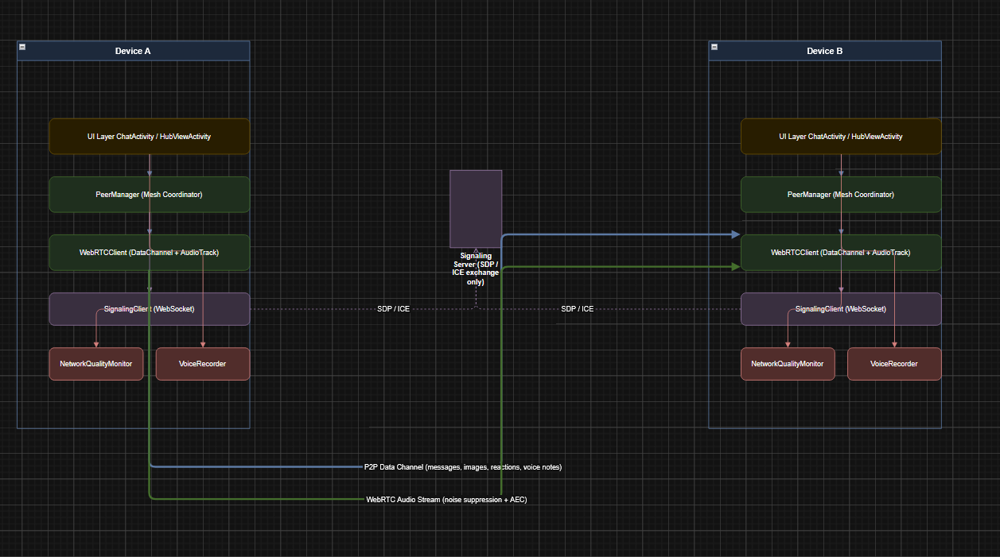
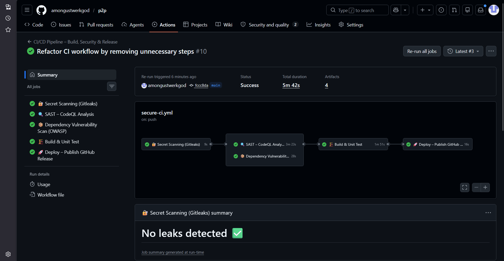
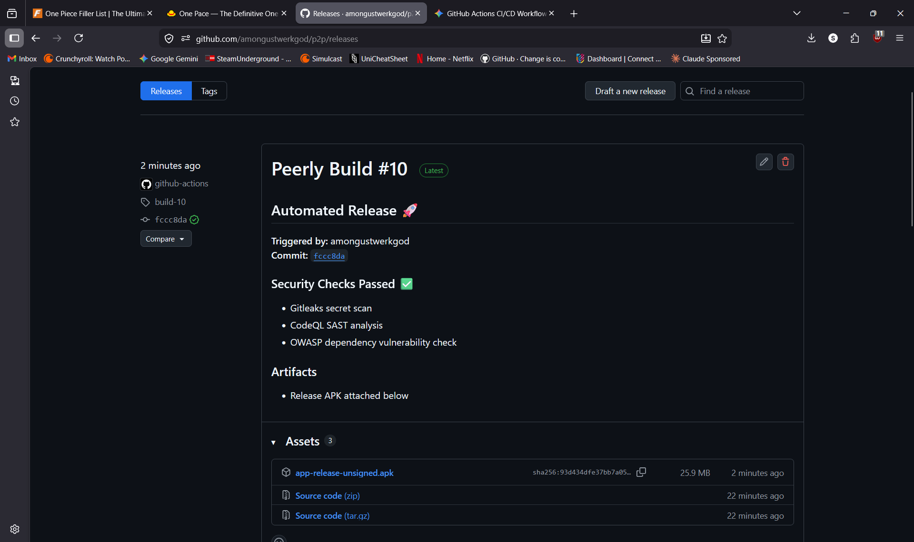

# Peerly

> A decentralized, peer-to-peer communication platform built on WebRTC — no servers, no middlemen, just direct connections.

---

## What is Peerly?

Peerly is an Android app that lets multiple people communicate directly through a shared **Room ID** — no accounts, no cloud storage, no central server relaying your messages. Everything travels peer-to-peer over encrypted WebRTC data channels.

---

## Features

### 🕸️ Multi-Peer Mesh Networking
- Full mesh topology — every peer connects directly to every other peer in the room
- **Partial mesh optimization** via lexicographical ID comparison prevents redundant duplicate connections, saving CPU and battery
- Strict caller/callee logic ensures simultaneous joins don't result in double-connections

### 🎙️ Voice Communication
- **Real-time voice calls** — WebRTC audio tracks streamed across the full mesh with hardware-level noise suppression and acoustic echo cancellation
- **Voice notes** — push-to-talk recording that broadcasts audio files to all peers, with an in-chat playback UI

### 🖼️ Media Support
- Send gallery images over the P2P data channel
- High-performance photo and GIF rendering via **Glide**

### 💬 Rich Messaging
- **Message reactions** — long-press any message to react with an emoji; reactions sync in real-time across all devices
- **Typing indicators** — real-time "is typing..." status visible to everyone in the group

### 📶 Connection Monitoring
- Live **Network Quality Indicator** measuring Ping / RTT (Round Trip Time)
- Color-coded feedback: Excellent · Fair · Poor

---

## UI Highlights

| Component | Details |
|---|---|
| **Dynamic Chat Header** | Shows peer name in 1-to-1 mode; automatically switches to "Group" mode (displaying Room ID) when 3+ peers join |
| **Chat Bubbles** | Redesigned with modern typography, improved padding, and `accent_muted` theming |
| **HubView Orbit** | Peer bubbles with screen-edge clamping and smooth entry animations |

---

## Architecture



```
Room (identified by Room ID)
│
├── Peer A ──────── Peer B
│    │  ╲          /  │
│    │    ╲      /    │
│    │      Peer C    │
│    └────────────────┘
         Full Mesh
```

- **Signaling** is handled via a lightweight server used only to exchange SDP offers/answers and ICE candidates
- Once connected, **all data flows directly between peers** — messages, media, audio, reactions
- Lexicographical peer ID comparison governs who acts as *caller* vs *callee*, preventing race conditions during simultaneous joins

---

## Tech Stack

| Layer | Technology |
|---|---|
| P2P Networking | WebRTC (Data Channels + Audio Tracks) |
| Image Loading | Glide (`com.github.bumptech.glide`) |
| Build System | Gradle |
| Language | Kotlin / Java (Android) |

---

## Getting Started

### Prerequisites
- Android Studio (latest stable)
- Android SDK 21+
- A device or emulator running Android 5.0 (Lollipop) or higher

### Build & Run
```bash
# Clone the repository
git clone https://github.com/your-org/peerly.git
cd peerly

# Open in Android Studio and sync Gradle, or build from CLI:
./gradlew assembleDebug

# Install on connected device
./gradlew installDebug
```

### Join a Room
1. Launch Peerly on two or more devices
2. Enter the same **Room ID** on each device
3. Tap **Join** — peers will discover and connect automatically

---

## Known Build Quirks

| Issue | Resolution |
|---|---|
| Gradle incremental build errors (`no data file for changedFile`) | Run `./gradlew clean` and invalidate caches in Android Studio |
| 401 errors fetching Glide | Use Maven coordinates `com.github.bumptech.glide` (not JitPack) |
| Missing vector assets (`ic_add`, `ic_mic`, `ic_play`) | Assets must be present in `res/drawable/`; see the `assets/` folder in this repo |
| WebRTC API version mismatches | Ensure your WebRTC dependency version matches the one in `build.gradle`; `RtpReceiver` track access and `JavaAudioDeviceModule` init are version-sensitive |
- **CodeQL Compilation:** Resolving CodeQL analysis failures by switching to `build-mode: manual` and explicitly defining the Gradle build step (`assembleDebug`) so the autobuilder could correctly trace the Java call graph.
- **OWASP Artifact Paths:** Fixing artifact upload errors by explicitly defining the output directory (`--out reports`) for the OWASP HTML report so the pipeline could locate it.
- **Secret Management:** Securely handling the `google-services.json` file. Instead of committing it to version control, it was stored as a GitHub Secret and dynamically injected into the build environment during pipeline execution.
- **Pipeline Optimization:** Implementing Gradle caching to speed up build times and reduce runner execution minutes.

---

## Contributing

Pull requests are welcome. For major changes, please open an issue first to discuss what you'd like to change.

1. Fork the repo
2. Create a feature branch (`git checkout -b feature/amazing-feature`)
3. Commit your changes (`git commit -m 'Add amazing feature'`)
4. Push to the branch (`git push origin feature/amazing-feature`)
5. Open a Pull Request

---


##  CI/CD Pipeline Explanation
The CI/CD pipeline is implemented using GitHub Actions (`ci.yml`) and consists of a structured, multi-stage workflow:
- **🔐 Secret Scanning (Gitleaks):** Runs first to scan the repository for any hardcoded secrets, API keys, or tokens.
- **🔍 SAST (CodeQL):** Analyzes the compiled Java source code to detect security vulnerabilities (e.g., path traversal, intent injection). Uses `build-mode: manual` to correctly trace the Android build process.
- **📦 Dependency Audit (OWASP):** Scans all Gradle dependencies against the NVD CVE database to prevent the inclusion of libraries with high/critical vulnerabilities.
- **🏗️ Build & Unit Test:** Compiles the Android project (`assembleRelease`), injects `google-services.json` securely from GitHub Secrets, and runs unit tests. Artifacts are cached for pipeline optimization.
- **🚀 Deploy (GitHub Release):** Upon a successful merge to `main`, this job automatically generates a GitHub Release and attaches the compiled `.apk` file for distribution.

##  Git Workflow Used
- **Feature Branching:** Development and pipeline configuration were isolated in a feature branch (`feature/devops-enhancement`).
- **Pull Requests (PRs):** Code was integrated into the `main` branch exclusively through Pull Requests to enforce code review and trigger automated CI checks.
- **Commit History:** Maintained a structured commit history with meaningful commit messages to track the evolution of the DevOps pipeline.


## 7. Screenshots
### Pipeline Success



### Deployment Output



